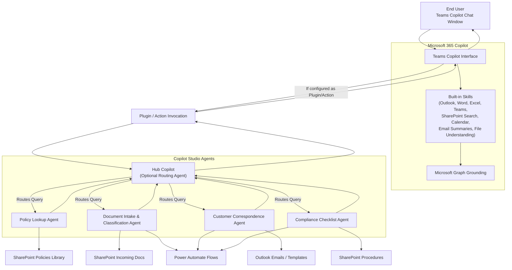

# 90‑Day Microsoft Copilot Rollout Strategy for a Tire‑Selling Organization
### Executive Summary
This 90‑day plan accelerates Copilot adoption across retail, service, and back‑office operations.  
It focuses on **productivity**, **customer experience**, **operational accuracy**, and **workflow automation** — the four areas where tire retailers see the fastest ROI.

---

# 1. Strategic Objectives
- Reduce manual workload in service centers and back‑office teams  
- Improve customer communication quality and turnaround time  
- Accelerate policy, procedure, and product lookup  
- Standardize documentation and reduce errors  
- Enable store managers and service advisors to work more efficiently  

---

# 2. 90‑Day Rollout Plan (Phased)

## **Phase 1 — Days 1–30: Foundation & Awareness**
### Goals
- Establish readiness  
- Build awareness  
- Identify high‑impact use cases  

### Key Activities
- Validate Microsoft 365 tenant readiness  
- Identify 3–5 pilot stores + back‑office teams  
- Conduct leadership briefings and demos  
- Build a Copilot Champion group (store managers, service advisors, back‑office leads)  
- Organize SharePoint libraries for policies, product specs, service procedures  

### Deliverables
- Readiness checklist  
- Pilot group roster  
- SharePoint knowledge base  
- Intro training modules  

### Example Use Cases (Phase 1)
- Summarizing tire warranty policies  
- Drafting customer emails (quotes, follow‑ups, service explanations)  
- Summarizing long email threads between stores and corporate  

---

## **Phase 2 — Days 31–60: Knowledge & Ability**
### Goals
- Train employees  
- Deploy first copilots  
- Enable hands‑on usage  

### Key Activities
- Deliver Copilot training for Word, Outlook, Teams  
- Build and deploy 3 core copilots:
  1. **Policy & Procedure Lookup Agent**  
  2. **Customer Communication Drafting Agent**  
  3. **Service Intake & Classification Agent**  
- Launch prompt library for store managers and service advisors  
- Run weekly Copilot Office Hours  

### Deliverables
- 3 production copilots  
- Prompt library v1  
- Training completion reports  
- Feedback log  

### Example Use Cases (Phase 2)
- “Explain this tire warranty in simple terms for a customer.”  
- “Draft a response to a customer asking about uneven tire wear.”  
- “Summarize this service ticket and extract next steps.”  

---

## **Phase 3 — Days 61–90: Reinforcement & Optimization**
### Goals
- Drive sustained usage  
- Optimize copilots  
- Establish governance  

### Key Activities
- Publish monthly “Copilot Wins” newsletter  
- Add new topics to Policy Lookup Agent (e.g., tire specs, service SOPs)  
- Build usage dashboards (Power BI or M365 analytics)  
- Conduct quarterly workflow review  
- Expand prompt library based on real usage  

### Deliverables
- Governance model  
- Usage dashboards  
- Updated copilots (v2)  
- Quarterly review report  

### Example Use Cases (Phase 3)
- “Compare the features of these two tire models for a customer.”  
- “Generate a checklist for a tire installation workflow.”  
- “Summarize store performance metrics for the week.”  

---

# 3. ROI Measurement Framework

## **A. Productivity ROI**
### Metrics
- Reduction in time spent drafting customer emails  
- Reduction in time spent searching policies/procedures  
- Reduction in manual documentation time  
- Faster onboarding for new service advisors  

### Example
Before Copilot:  
- Service advisors spend ~12 minutes drafting a customer explanation  
After Copilot:  
- Draft generated in ~30 seconds  
**Time saved per advisor per day: 45–60 minutes**

---

## **B. Customer Experience ROI**
### Metrics
- Faster response times to customer inquiries  
- More consistent explanations of tire warranties and services  
- Higher customer satisfaction scores (CSAT/NPS)  
- Reduction in escalations due to miscommunication  

### Example
Before Copilot:  
- Warranty explanations vary by advisor  
After Copilot:  
- Standardized, accurate, customer‑friendly explanations  
**Result: Fewer escalations and improved trust**

---

## **C. Operational Accuracy ROI**
### Metrics
- Reduction in errors in service documentation  
- Reduction in missed steps in service workflows  
- Improved compliance with safety and installation procedures  

### Example
Copilot‑generated checklists reduce missed steps in tire installation workflows by **15–20%**.

---

## **D. Financial ROI**
### Metrics
- Labor hours saved  
- Reduced rework  
- Faster ticket processing  
- Higher throughput in service bays  

### Example Calculation
If 50 advisors save **45 minutes/day**, that’s:  
- 37.5 hours/day  
- 750 hours/month  
- At $25/hour labor cost → **$18,750/month saved**  

This excludes gains from:
- Faster service bay turnover  
- Fewer escalations  
- Higher customer retention  

---

# 4. Executive Talking Points (Leadership‑Ready)

- “Copilot reduces manual work so our teams can focus on customers, not paperwork.”  
- “We are standardizing communication and reducing errors across all stores.”  
- “This rollout improves service quality, reduces escalations, and increases throughput.”  
- “We will measure ROI through productivity, customer experience, accuracy, and financial impact.”  
- “By Day 90, we will have three production copilots and a trained workforce using AI daily.”  

---

# 5. Final Deliverables by Day 90
- 3 production copilots deployed across pilot stores  
- Trained workforce (store managers, service advisors, back‑office teams)  
- Prompt library for retail + service operations  
- Governance + reinforcement model  
- ROI dashboard for leadership  
- Repeatable framework for scaling to all stores  

# Techniques to Build and Share a Prompt Library for Microsoft Copilot

A prompt library helps frontline teams, service advisors, store managers, and back‑office staff use Copilot consistently and effectively. Below are proven techniques to build, organize, and distribute a prompt library at scale.

---

# 1. Build Prompts Using the “Scenario → Action → Output” Pattern

## Technique
Structure every prompt with:
- **Scenario**: The context or situation  
- **Action**: What the user wants Copilot to do  
- **Output**: The format or structure of the result  

## Example (Tire Retail)
**Scenario:** “A customer is asking why their tires are wearing unevenly.”  
**Action:** “Explain the likely causes in simple language.”  
**Output:** “Provide a 3‑bullet explanation and a recommended next step.”

---

# 2. Create Role‑Based Prompt Packs

## Technique
Group prompts by job role so each team sees only what’s relevant.

## Examples
- **Service Advisor Pack**  
  - “Draft a customer explanation for recommended tire rotation.”  
  - “Summarize this service ticket and extract next steps.”

- **Store Manager Pack**  
  - “Create a weekly performance summary for my store.”  
  - “Draft a coaching message for a technician.”

- **Back‑Office Pack**  
  - “Summarize this vendor contract and extract renewal dates.”

---

# 3. Use Real Documents to Build “Grounded Prompts”

## Technique
Build prompts that reference:
- Tire warranty PDFs  
- Service SOPs  
- Product spec sheets  
- Store policies  
- Safety procedures  

## Example
“Using the tire warranty document in SharePoint, summarize the customer’s coverage in 4 bullets.”

---

# 4. Create Prompt Templates with Variables

## Technique
Use placeholders so employees can reuse prompts quickly.

## Example Template
“Draft a customer email explaining **{issue}**, referencing the **{policy name}** policy, and offering **{recommended service}**.”

---

# 5. Build a “Top 20 Prompts” Quick‑Start Sheet

## Technique
Identify the highest‑impact prompts and publish them as a one‑page cheat sheet.

## Example Categories
- Customer communication  
- Warranty explanations  
- Service ticket summaries  
- Product comparisons  
- Store performance summaries  

---

# 6. Publish the Prompt Library in SharePoint

## Technique
Create a **central SharePoint site** with:
- Prompt categories  
- Searchable tags  
- Examples with screenshots  
- Short videos showing how to use prompts  

## Why it works
SharePoint becomes the **single source of truth** for all stores.

---

# 7. Integrate Prompts Directly into Teams Channels

## Technique
Pin prompt collections in:
- Store Teams channels  
- Service advisor channels  
- Back‑office channels  

## Example
A pinned tab called **“Copilot Prompts – Service Advisors”**.

---

# 8. Embed Prompts Inside Copilot Studio Agents

## Technique
Your custom copilots can **suggest prompts** inside the chat window.

## Example
Policy Lookup Agent can show:
- “Explain this policy to a customer.”  
- “Summarize this policy in 3 bullets.”  
- “Compare two policies.”

This reduces training time dramatically.

---

# 9. Use QR Codes for Frontline Teams

## Technique
Print QR codes that link to:
- Prompt library pages  
- Role‑based prompt packs  
- Quick‑start guides  

## Example
A QR code at the service desk labeled:  
**“Scan for Customer Communication Prompts”**

---

# 10. Run Monthly “Prompt Refresh” Cycles

## Technique
Every 30 days:
- Review usage analytics  
- Add new prompts based on real scenarios  
- Retire unused prompts  
- Highlight “Prompt of the Month”  

This keeps the library fresh and relevant.

---

# 11. Train Champions to Contribute Prompts

## Technique
Empower store managers and advisors to submit:
- New prompts  
- Improved versions  
- Real examples that worked well  

## Benefit
The library becomes **crowd‑sourced**, not centrally dictated.

---

# 12. Provide Prompts in Multiple Formats

## Formats to Offer
- Markdown pages  
- One‑page PDFs  
- Teams tabs  
- SharePoint lists  
- Copilot Studio agent suggestions  
- Printed cards for service desks  

Different roles prefer different formats.

---

# Summary Table

| Technique | What It Enables |
|----------|------------------|
| Scenario → Action → Output | Clear, repeatable prompt structure |
| Role‑based packs | Relevance for each job role |
| Grounded prompts | Accurate, policy‑aligned answers |
| Variable templates | Fast reuse |
| Top 20 prompts | Quick adoption |
| SharePoint library | Centralized access |
| Teams integration | Prompts where work happens |
| Embedded in agents | Guided prompting |
| QR codes | Easy access for frontline teams |
| Monthly refresh | Continuous improvement |
| Champion contributions | Scalable library growth |
| Multi‑format distribution | Accessibility for all roles |

# How to Provide a Feedback Interface for Teams Channel Members to Improve a Copilot Agent

Copilot Studio agents do not self‑learn from user chats, so you must create a **feedback loop** that allows channel members to submit feedback and enables admins to improve the agent based on that feedback.

Below are proven techniques to collect feedback and continuously improve your Copilot agent.

---

# 1. Add a “Feedback Button” Inside the Copilot Agent (Recommended)

## Technique
Embed a **feedback prompt** directly inside the agent’s conversation flow.

### How it works
- After each response, the agent asks:
  “Was this helpful? Yes / No”
- If “No,” the agent collects:
  - What was missing  
  - What was incorrect  
  - What the user expected  

### Where feedback goes
- Store feedback in:
  - SharePoint list  
  - Dataverse table  
  - Excel file in SharePoint  

### Why this works
- Feedback is captured **in context**  
- Easy for users  
- Structured data for admins  

---

# 2. Create a “Feedback Form” Tab in the Teams Channel

## Technique
Add a **Microsoft Form** or **Power Apps form** as a tab next to the Copilot tab.

### Form fields
- What prompt did you use?  
- What was wrong with the response?  
- What should the agent do instead?  
- Attach screenshot (optional)  

### Benefits
- Simple  
- Centralized  
- Works for all channel members  

---

# 3. Use a SharePoint List as a Feedback Repository

## Technique
Create a SharePoint list called **“Copilot Feedback”** and add it as a tab in the channel.

### Columns
- User  
- Date  
- Prompt used  
- Copilot response  
- Issue type (accuracy, tone, missing data, wrong workflow)  
- Suggested improvement  

### Benefits
- Easy to filter  
- Easy to export  
- Easy to assign follow‑up tasks  

---

# 4. Add a “Feedback” Command Inside the Copilot Agent

## Technique
Teach the agent a topic like:

**“I want to give feedback.”**

When triggered, the agent:
- Asks structured questions  
- Stores the feedback in SharePoint or Dataverse  
- Optionally notifies the admin team  

### Benefits
- Users don’t leave the chat  
- Feedback is contextual  
- Works on desktop + mobile  

---

# 5. Use Adaptive Cards for Quick Feedback

## Technique
After certain responses, the agent posts an **Adaptive Card** with:
- 👍 Helpful  
- 👎 Not Helpful  
- “Tell us more” text box  

### Benefits
- Fast  
- Familiar UI  
- Works well in Teams  

---

# 6. Create a “Copilot Feedback” Channel for Discussion

## Technique
Add a dedicated Teams channel where:
- Users post examples of bad responses  
- Admins discuss improvements  
- Champions share best prompts  

### Benefits
- Transparent  
- Collaborative  
- Great for early rollout phases  

---

# 7. Automate Feedback Collection with Power Automate

## Technique
Use Power Automate to:
- Capture feedback from Forms, SharePoint, or Adaptive Cards  
- Notify admins  
- Create tasks in Planner or Azure DevOps  
- Track trends over time  

### Benefits
- Automated  
- Scalable  
- Great for multi‑store or multi‑department deployments  

---

# 8. Publish a “How to Give Feedback” Guide in the Channel

## Technique
Pin a document or tab explaining:
- How to report issues  
- What types of feedback are useful  
- How often the agent is updated  
- Who reviews the feedback  

### Benefits
- Sets expectations  
- Reduces noise  
- Improves feedback quality  

---

# Summary Table

| Method | User Effort | Admin Effort | Best For |
|--------|-------------|--------------|----------|
| Feedback button inside agent | Very low | Medium | Daily use, high adoption |
| Forms tab | Low | Low | Simple deployments |
| SharePoint list | Medium | Medium | Structured feedback |
| “Feedback” command | Low | Medium | In‑chat experience |
| Adaptive Cards | Very low | Medium | Quick reactions |
| Feedback channel | Medium | Low | Early rollout collaboration |
| Power Automate automation | Low | Medium | Scaling across stores |
| Feedback guide | Low | Low | Training & onboarding |

---

# One‑Sentence Summary
**You provide a feedback interface by adding forms, buttons, commands, or tabs in Teams that let users submit structured feedback, which admins then use to update and improve the Copilot agent.**

# Customer Correspondence Drafting Copilot Agent  
### Full Build & Deployment Guide (Copilot Studio)

This guide explains how to build, publish, deploy, and enable a **Customer Correspondence Drafting Copilot Agent** for a tire‑selling organization’s back‑office and service teams.

---

# PHASE 1 — Build the Agent in Copilot Studio

## Step 1 — Create a New Agent
1. Open **Copilot Studio**  
2. Select **Create Copilot**  
3. Name it: **Customer Correspondence Drafting Copilot**  
4. Choose **Standard**  
5. Click **Create**

---

## Step 2 — Define Strong System Instructions
Navigate to **Settings → Instructions** and add:

# ADKAR-Aligned Copilot Rollout Plan

| ADKAR Stage | Goal | Activities / Actions | Deliverables | Success Indicators |
|-------------|-------|----------------------|--------------|--------------------|
| **A — Awareness** | Ensure employees understand *why* Copilot is being introduced | - Executive announcement explaining purpose - Intro video: “What Copilot means for our back-office team” - Live demo (summaries, drafting, policy lookup) - FAQ page on SharePoint - Visual comms (Teams banners, posters) | - Awareness campaign - FAQ hub - Demo recording | - 80% attendance in intro session - Employees can articulate the “why” - Reduced misconceptions |
| **D — Desire** | Build motivation and willingness to adopt Copilot | - Show before/after workflows - Highlight time saved - Identify champions - Incentives (recognition, weekly highlights) - Demonstrate high-impact use cases (letters, summaries, deadlines) | - Champion roster - Use-case showcase deck | - Champions volunteer - Employees request access - Positive sentiment in Teams |
| **K — Knowledge** | Train employees on *how* to use Copilot effectively | **Training Modules:** 1. Copilot in Word (summaries, tone rewrite) 2. Copilot in Outlook (draft replies, thread summaries) 3. Copilot in Teams (meeting recap, policy lookup) 4. Copilot Studio basics for champions  **Artifacts:** - Prompt library - Micro-learning videos - SharePoint training hub | - Training curriculum - Prompt library - Video modules | - 70% training completion - Champions build first agent - Daily use of prompt library |
| **A — Ability** | Enable employees to *perform* new workflows using Copilot | - Weekly Copilot Office Hours - Hands-on practice with real documents - Shadowing with champions - Deploy 3 key agents: 1. Policy Lookup Agent 2. Customer Correspondence Agent 3. Document Intake & Classification Agent | - 3 production-ready copilots - Updated workflows - Practice exercises | - Employees complete tasks independently - Daily agent usage - Reduced manual processing time |
| **R — Reinforcement** | Sustain long-term adoption and continuous improvement | - Monthly “Copilot Wins” newsletter - Recognition for top users - Quarterly workflow reviews - Update prompt library - Monitor agent logs - Maintain SharePoint policy library | - Reinforcement plan - Usage dashboards - Updated knowledge base | - Sustained usage after 90 days - Continuous agent improvements - Faster turnaround times - Fewer errors and rework |

# 30‑60‑90 Day Copilot Rollout Plan

| Timeline | Objectives | Key Activities | Deliverables | Success Indicators |
|----------|-------------|----------------|--------------|--------------------|
| **Days 1–30: Foundation & Awareness** | Build awareness, establish technical readiness, and prepare the team for Copilot adoption | - Announce Copilot rollout and purpose - Conduct intro demo for back-office team - Set up Microsoft 365 tenant readiness (permissions, security, licensing) - Configure SharePoint libraries for grounding - Identify Copilot Champions - Publish FAQ + intro materials on SharePoint - Begin training: Copilot in Word, Outlook, Teams | - Copilot readiness checklist - SharePoint policy library organized - Intro training modules - Champion roster | - 80% team awareness - Champions identified - Tenant validated for Copilot Studio |
| **Days 31–60: Knowledge & Ability** | Train employees, build core copilots, and enable hands-on usage | - Deliver hands-on training sessions - Launch prompt library for legal operations - Build 3 core copilots: 1. Policy Lookup Agent 2. Customer Correspondence Agent 3. Document Intake & Classification Agent - Deploy copilots to Teams - Run weekly Copilot Office Hours - Collect early feedback | - 3 production-ready copilots - Prompt library v1 - Training completion reports - Feedback log | - 70% training completion - Daily usage of copilots - Reduced manual document processing time |
| **Days 61–90: Reinforcement & Optimization** | Drive sustained adoption, optimize workflows, and establish governance | - Publish “Copilot Wins” newsletter - Enhance copilots based on feedback - Add new topics to Policy Lookup Agent - Implement governance model (data refresh, logs, updates) - Create usage dashboards (Power BI or M365 analytics) - Conduct quarterly workflow review - Expand prompt library | - Governance framework - Usage dashboards - Updated copilots (v2) - Quarterly review report | - Sustained usage after 90 days - Faster turnaround times - Fewer errors and rework - Continuous agent improvements |

# High-Level Categories of Microsoft Copilot Use Cases

| Category | Description | Example Use Cases | Primary Apps / Tools |
|----------|-------------|-------------------|-----------------------|
| **Content Creation & Drafting** | Generate, rewrite, or refine content | Draft customer letters, rewrite legal notices, create templates, summarize emails | Word, Outlook, Teams, Loop |
| **Document Understanding & Summarization** | Read, interpret, and extract insights from documents | Summaries, deadline extraction, risk flagging, version comparison | Word, Teams, Copilot Chat |
| **Search, Retrieval & Knowledge Lookup** | Find information across organizational data | Policy lookup, procedure search, retrieve past cases, Q&A with citations | Copilot Chat, Teams, Copilot Studio |
| **Workflow Automation & Task Execution** | Trigger or execute business processes | Start workflows, route documents, create tasks, generate case files | Power Automate, Copilot Studio, Teams |
| **Data Analysis & Insights** | Analyze structured or semi-structured data | Trend analysis, case volume summaries, bottleneck detection | Excel, Power BI, Copilot Chat |
| **Communication & Collaboration Support** | Improve meetings and communication | Meeting recap, email thread summaries, follow-up drafting, agenda creation | Teams, Outlook |
| **Compliance, Governance & Risk Support** | Enforce rules and reduce operational risk | Flag risky clauses, ensure template usage, summarize regulatory requirements | Word, SharePoint, Copilot Studio |
| **Personalized Assistance & Productivity** | Act as a personal assistant for each employee | Task prioritization, daily summaries, personalized drafting, organizing info | Copilot Chat, Teams |
| **Custom Agents & Domain-Specific Automation** | Build specialized copilots for business workflows | Policy lookup agent, document intake agent, correspondence drafting agent | Copilot Studio, Teams, SharePoint |

# Mapping Copilot Use Case Categories to Copilot Studio Agents

| Copilot Use Case Category | What It Enables | Recommended Copilot Studio Agents to Build | Description of the Agent |
|---------------------------|------------------|--------------------------------------------|---------------------------|
| **Content Creation & Drafting** | Drafting, rewriting, templating | **Customer Correspondence Drafting Agent** | Reads customer emails, drafts compliant responses, inserts legal disclaimers, adjusts tone. |
|                           |                  | **Template Generator Agent** | Creates Word templates for notices, acknowledgments, affidavits, and customer letters. |
| **Document Understanding & Summarization** | Summaries, extraction, comparison | **Legal Document Summarization & Risk Flagging Agent** | Summarizes legal docs, extracts deadlines, flags risks, generates checklists. |
|                           |                  | **Document Comparison Agent** | Compares two versions of a contract or letter and highlights differences. |
| **Search, Retrieval & Knowledge Lookup** | Policy lookup, Q&A, citations | **Policy & Procedure Lookup Agent** | Searches SharePoint policies, summarizes rules, provides citations, links to documents. |
|                           |                  | **Case History Lookup Agent** | Retrieves past cases, correspondence, and decisions from SharePoint. |
| **Workflow Automation & Task Execution** | Routing, tasks, flows | **Document Intake & Classification Agent** | Reads incoming documents, classifies them, extracts metadata, routes to correct SharePoint folder. |
|                           |                  | **Case File Builder Agent** | Creates case folders, checklists, tasks, and initial summaries automatically. |
| **Data Analysis & Insights** | Trends, summaries, insights | **Back‑Office Insights Agent** | Analyzes SharePoint lists (cases, disputes, deadlines) and produces insights or summaries. |
|                           |                  | **Compliance Metrics Agent** | Summarizes compliance KPIs, overdue tasks, and upcoming deadlines. |
| **Communication & Collaboration Support** | Meetings, email threads, follow-ups | **Meeting Recap & Action Item Agent** | Summarizes Teams meetings, extracts decisions, assigns tasks, and logs notes. |
|                           |                  | **Thread Summarization Agent** | Summarizes long Outlook threads and extracts required actions. |
| **Compliance, Governance & Risk Support** | Risk detection, policy alignment | **Compliance Checklist Generator Agent** | Generates step-by-step compliance checklists based on document type or case type. |
|                           |                  | **Risk Review Agent** | Flags missing signatures, missing pages, risky clauses, or non-compliant language. |
| **Personalized Assistance & Productivity** | Task prioritization, daily summaries | **Daily Briefing Agent** | Summarizes your day, upcoming deadlines, pending cases, and tasks from Planner/SharePoint. |
|                           |                  | **Task Routing Agent** | Creates and assigns tasks based on incoming documents or emails. |
| **Custom Agents & Domain-Specific Automation** | Specialized workflows | **Legal Operations Hub Agent** | A unified agent that routes queries to sub‑agents (policy lookup, correspondence, intake, compliance). |
|                           |                  | **Customer Dispute Workflow Agent** | Automates intake, classification, task assignment, and correspondence for disputes. |

# Understanding How Copilot Agents Work Behind a Single Chat Interface

## Overview
End users typically interact with **one chat interface**, but behind the scenes, **multiple copilots, skills, or actions** may be involved in generating a response.  
However, the behavior depends on *which Copilot entry point* is being used.

---

## 1. Microsoft 365 Copilot (Teams Chat Window)

### What the user sees
- A **single Copilot chat interface** inside Microsoft Teams.

### What happens behind the scenes
- Microsoft 365 Copilot automatically uses multiple **built‑in skills**, such as:
  - Outlook skill  
  - Word skill  
  - Excel skill  
  - Teams skill  
  - SharePoint search skill  
  - Calendar skill  
  - Email summarization  
  - File understanding  

### Important clarification
- These are **Microsoft‑built skills**, not your custom Copilot Studio agents.
- **Custom agents are NOT automatically invoked** unless you explicitly connect them as:
  - Plugins  
  - Actions  
  - Or integrate them through a hub agent  

---

## 2. Copilot Studio Agents (Teams App)

### What the user sees
- Each Copilot Studio agent appears as **its own app** in Teams.
- Users interact with **one chat interface per agent**.

### What happens behind the scenes
A single Copilot Studio agent can orchestrate:
- Multiple topics  
- Multiple Power Automate actions  
- Multiple data sources  
- Multiple plugins  
- Even other copilots (via APIs)  

### Hub Agent Pattern
You can build a **master “Hub Copilot”** that routes queries to:
- Policy Lookup Agent  
- Document Intake Agent  
- Correspondence Drafting Agent  
- Compliance Checklist Agent  

This creates the effect of **one interface with many copilots behind it**.

---

## 3. So Is the User’s Understanding Accurate?

### ✔ Accurate:
- One chat interface can rely on multiple skills behind the scenes.
- One Copilot Studio agent can orchestrate multiple workflows.

### ❌ Not automatic:
- The Teams Copilot chat window does **not** automatically call your custom

# Copilot Agent vs. Copilot Skill — Key Differences

## Overview
Copilot Agents and Copilot Skills serve different purposes in the Microsoft Copilot ecosystem.  
An **Agent** is the conversational orchestrator, while a **Skill** is a capability the agent can call to perform a task.

---

## 1. Copilot Agent (The “Brain”)

A **Copilot Agent** is a complete conversational AI application built in **Copilot Studio**.

### Characteristics
- Has its own **chat interface**
- Has **system instructions**
- Contains **topics** and **conversation logic**
- Uses **grounding data sources** (SharePoint, websites, files)
- Can call **actions** (Power Automate, APIs, connectors)
- Can be deployed to **Teams**, web, or other channels
- Understands user intent and orchestrates workflows

### What It Does
- Interprets user prompts  
- Decides which skills/actions to call  
- Retrieves data  
- Generates responses  
- Manages the entire conversation flow  

### Analogy
A **Copilot Agent** is like a *full employee* who talks to the user, understands the request, and decides what tools to use.

---

## 2. Copilot Skill (The “Capability”)

A **Copilot Skill** is a specific capability or function that an agent can invoke.

### Types of Skills
- **Built‑in Microsoft 365 skills**
  - Outlook skill  
  - Word skill  
  - Excel skill  
  - SharePoint search skill  
  - Calendar skill  
  - Email summarization  
  - File understanding  

- **Custom skills**
  - Power Automate flows  
  - API calls  
  - Connectors  
  - Dataverse actions  
  - Plugins  

### What It Does
- Executes a **specific task**
- Returns **data or results** to the agent
- Does **not** manage conversation
- Does **not** interact with the user directly

### Analogy
A **Skill** is like a *tool* the employee uses — such as “search SharePoint,” “summarize a document,” or “create a task.”

---

## 3. Relationship Between Agents and Skills

| Concept | Copilot Agent | Copilot Skill |
|--------|----------------|---------------|
| Is it a chatbot? | **Yes** | No |
| Has its own chat interface? | **Yes** | No |
| Understands user intent? | **Yes** | No |
| Executes tasks? | Calls skills | Performs the task |
| Can call other copilots? | Yes | No |
| Can be deployed to Teams? | **Yes** | No |
| Reusable across agents? | No | **Yes** |
| Role | The “brain” | The “tool” |

---

## 4. Example Workflow

### User asks:
“Summarize this legal document and extract deadlines.”

### The Copilot Agent:
- Understands the request  
- Retrieves the document  
- Calls skills to perform tasks  
- Generates a final answer  

### Skills used:
- Document understanding  
- Summarization  
- Deadline extraction  
- SharePoint search  

The **agent orchestrates**, the **skills execute**.

---

## 5. How This Applies to a Legal Back‑Office Team

### Agents you might build:
- Policy Lookup Agent  
- Document Intake Agent  
- Customer Correspondence Agent  
- Compliance Checklist Agent  

### Skills these agents will use:
- SharePoint search  
- Document summarization  
- Deadline extraction  
- Power Automate workflows  
- Email drafting  
- Case file creation  

Agents = the “front‑end brains”  
Skills = the “back‑end capabilities”

---

## One‑Sentence Summary
**A Copilot Agent is the full conversational bot; a Copilot Skill is a capability the agent uses to perform tasks.**

### Here is a clean, architecture‑grade Mermaid diagram showing how Microsoft Teams Copilot interacts with Copilot Studio agents, including built‑in skills, grounding, plugins/actions, and optional hub‑agent routing.

