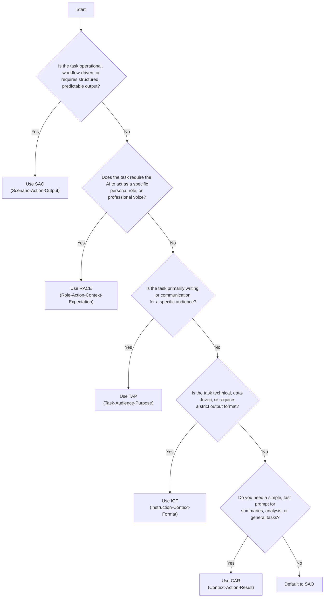

# 📊 Side‑by‑Side Comparison of Prompt Frameworks  
### SAO vs CAR vs RACE vs TAP vs ICF

| Framework | Meaning | Best For | Strengths | Limitations |
|----------|---------|----------|-----------|-------------|
| **SAO** | **Scenario – Action – Output** | Operational tasks, Copilot Studio, workflow automation | Clear structure, reduces hallucinations, easy to teach, consistent | Doesn’t define role or audience |
| **CAR** | **Context – Action – Result** | Business tasks, summarization, analysis | Simple, intuitive, similar to SAO | Less emphasis on output formatting |
| **RACE** | **Role – Action – Context – Expectation** | Customer service, creative tasks, persona‑based prompts | Defines AI role, strong guardrails, great for tone control | More complex; can be overkill for simple tasks |
| **TAP** | **Task – Audience – Purpose** | Writing, marketing, customer communication | Ensures tone + audience alignment | Not ideal for technical or structured outputs |
| **ICF** | **Instruction – Context – Format** | Technical tasks, data analysis, structured outputs | Very precise, great for Excel/Power BI/engineering | Less conversational; rigid for creative tasks |

---

# 🧩 Quick Visual Summary

| Framework | Adds Context | Defines Role | Defines Audience | Defines Output Format | Best For |
|----------|--------------|--------------|------------------|------------------------|----------|
| **SAO** | ✅ | ⚪ | ⚪ | ✅ | Enterprise workflows |
| **CAR** | ✅ | ⚪ | ⚪ | ⚪ | General business tasks |
| **RACE** | ✅ | ✅ | ⚪ | ✅ | Customer‑facing + persona prompts |
| **TAP** | ⚪ | ⚪ | ✅ | ⚪ | Writing + communication |
| **ICF** | ✅ | ⚪ | ⚪ | ✅ | Technical + structured tasks |

---

# 🏁 When to Use Each (Practical Guidance)

### **Use SAO when:**
- You want predictable, structured outputs  
- You’re building prompts for Copilot Studio  
- You need to reduce hallucinations  
- You’re designing workflow automation  

### **Use CAR when:**
- You want a simple, fast prompt  
- You’re summarizing or analyzing content  

### **Use RACE when:**
- You need the AI to “act as” a specific role  
- Tone, persona, or professionalism matters  

### **Use TAP when:**
- You’re writing for a specific audience  
- You’re crafting emails, announcements, or marketing content  

### **Use ICF when:**
- You need strict formatting  
- You’re working with data, tables, or technical tasks  

---

# 🌳 Decision Tree: Choosing the Right Prompt Framework  
### SAO • CAR • RACE • TAP • ICF

